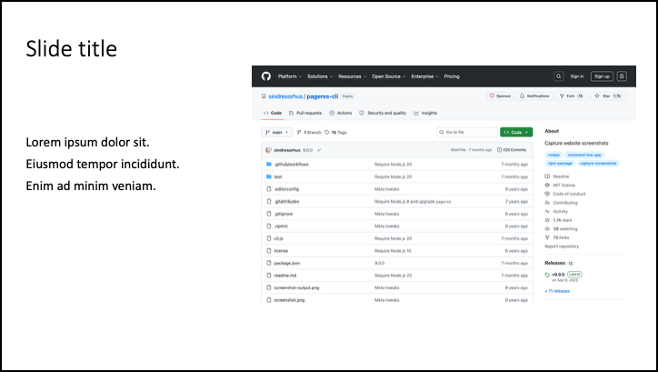
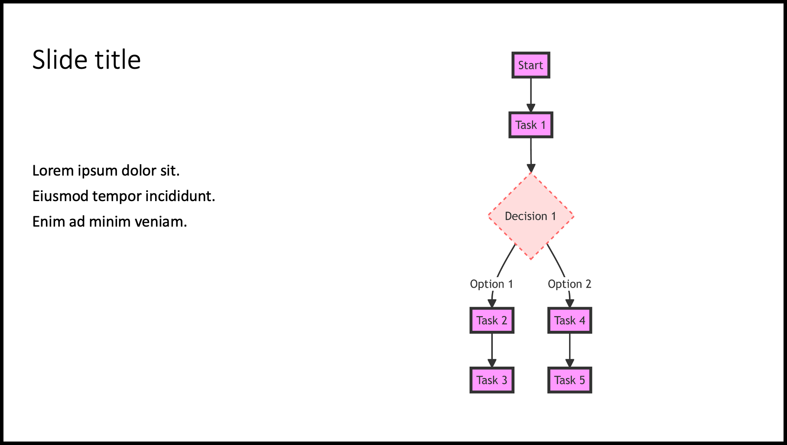
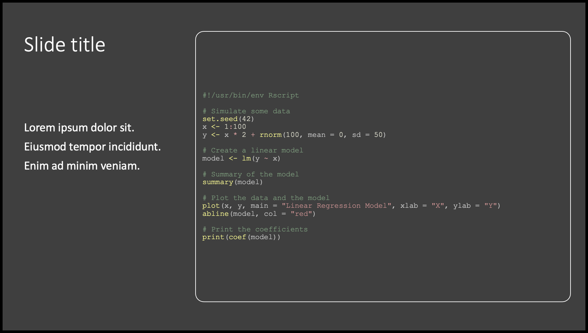

# fast-pptx

Quickly make a PowerPoint presentation from a directory of code snippets, CSV files, TSV files, Graphviz DOT files, Mermaid mmd files, images, PDFs, and URLs. **fast-pptx** converts the CSV and TSV files to Markdown tables, renders the DOT and mmd files, creates high-resolution images from the PDFs, captures high-resolution screenshots of the websites, and then builds a Markdown presentation file for input to [Pandoc](https://pandoc.org). The Markdown file is then converted to PowerPoint presentations using templates that preserve syntax highlighting and make effective use of slide space. You can edit the Markdown to add content and regenerate the presentations using the included `pandoc.sh` script that is generated, or you can edit the presentations in PowerPoint.

Turn this:

```text
https://github.com/sindresorhus/pageres-cli
```

And this:

```text
graph TD
    A[Start] --> B[Task 1]
    B --> C{Decision 1}
    C -->|Option 1| D[Task 2]
    D --> E[Task 3]
    C -->|Option 2| F[Task 4]
    F --> G[Task 5]

    classDef default fill:#f9f,stroke:#333,stroke-width:4px;
    classDef decision fill:#fdd,stroke:#f66,stroke-width:2px,stroke-dasharray: 5, 5;
    class C decision
```

And this:

```text
#!/usr/bin/env Rscript

# Simulate some data
set.seed(42)
x <- 1:100
y <- x * 2 + rnorm(100, mean = 0, sd = 50)

# Create a linear model
model <- lm(y ~ x)

# Summary of the model
summary(model)

# Plot the data and the model
plot(x, y, main = "Linear Regression Model", xlab = "X", ylab = "Y")
abline(model, col = "red")

# Print the coefficients
print(coef(model))
```

Into this:







See the [sample output](includes/README_sample_output.md) for the full collection of slides produced by the included sample input files.

## Author

Paul Stothard

## Quick start

[Install dependencies and download **fast-pptx**](#install), place your source files into a single directory and then run **fast-pptx**:

```bash
./fast-pptx.sh -i input-directory -o output-directory
```

The source files are used to build content, which is added to a PowerPoint presentation created in the output directory. If code snippets are included in the input directory, then a second presentations is created with the code snippets converted to syntax-highlighted code blocks.

The slides can then be edited in PowerPoint to change the order of slides, add or modify text, adjust font sizes, and choose designs for specific slides (using PowerPoint Designer by choosing **Design > Design Ideas** on the ribbon). The file size can then be reduced using **File > Compress Pictures...**.

You can also edit or replace the `theme.pptx` and `theme_code_blocks.pptx` files that are written to the output folder's `includes` directory and then re-generate the slides using the `pandoc.sh` script that is included in the output folder. These reference `.pptx` files serve as templates. Pandoc will use these files as a basis for creating the new presentations. This means that instead of the default PowerPoint styles, your presentation will inherit the styles defined in the reference documents — including fonts, colors, bullet styles, and other formatting. A separate reference document is used for the code blocks to allow for smaller fonts and different colors to be specified.

To combine the content from the `slides.pptx` and `slides_code_blocks.pptx` into a single presentation, open both presentations and then copy and paste slides from one presentation to the other. Click on the **Paste Options** button that appears after pasting and choose **Keep Source Formatting**.

## Supported source file types for the input directory

| Type                  | Filename          | Converted to                      | PowerPoint Content Generated                                                                            |
|-----------------------|-------------------|-----------------------------------|---------------------------------------------------------------------------------------------------------|
| Code Snippet          | \*.\<language\>   | Not Converted                     | Two slides (one-column and two-column) per code snippet file showing syntax-highlighted code            |
| CSV File              | \*.csv            | Markdown Table                    | Two slides (one-column and two-column) per CSV file showing the content as a table                      |
| Dot File for Graphviz | \*.dot            | PNG and Resized PNG               | Two slides (one-column and two-column) per DOT file showing the rendered graph                          |
| GIF File              | \*.gif            | Not Converted                     | Two slides (one-column and two-column) per GIF file showing the GIF                                     |
| JPG File              | \*.jpg or \*.jpeg | PNG and Resized PNG               | Two slides (one-column and two-column) per JPG or JPEG file showing the resized PNG                     |
| MMD File for Mermaid  | \*.mmd            | PNG and Resized PNG               | Two slides (one-column and two-column) per MMD file showing the rendered graph                          |
| PDF File              | \*.pdf            | PNG and Resized PNG               | Two slides (one-column and two-column) per PDF file showing the resized PNG                             |
| PNG File              | \*.png            | Resized PNG                       | Two slides (one-column and two-column) per PNG file showing the resized PNG                             |
| SVG File              | \*.svg            | PNG and Resized PNG               | Two slides (one-column and two-column) per SVG file showing the resized PNG                             |
| TIFF File             | \*.tiff           | PNG and Resized PNG               | Two slides (one-column and two-column) per TIFF file showing the resized PNG                            |
| TSV File              | \*.tsv            | Markdown Table                    | Two slides (one-column and two-column) per TSV file showing the content as a table                      |
| URLs (one per line)   | sites.txt         | PNG and Resized PNG for Each Site | Two slides (one-column and two-column) per web site URL showing the resized PNG screenshot for the site |

## Output directory structure

```text
outdir
├── slides.pptx
├── slides.md
├── slides_code_blocks.pptx
├── slides_code_blocks.md
├── pandoc.sh
└── includes
    ├── theme.pptx
    ├── theme_code_blocks.pptx
    └── resized
```

## Install

**fast-pptx** requires the following:

* [csv2md](https://github.com/pstaender/csv2md)
* [Graphviz](https://graphviz.org)
* [mermaid-cli](https://github.com/mermaid-js/mermaid-cli)
* [ImageMagick](https://imagemagick.org)
* [pageres-cli](https://github.com/sindresorhus/pageres-cli)
* [pandoc](https://pandoc.org)
* [poppler](https://poppler.freedesktop.org)
* [svgexport](https://github.com/shakiba/svgexport)

On macOS these can be installed as follows:

```bash
brew install graphviz
brew install imagemagick
brew install node
brew install pandoc
brew install poppler
npm install -g mermaid.cli
npm install -g csv2md
npm install -g pageres-cli
npm install -g svgexport
```

Clone the repository and test `fast-pptx.sh`:

```bash
git clone git@github.com:paulstothard/fast-pptx.git
cd fast-pptx/scripts
./fast-pptx.sh -i sample_input -o sample_output
```

Or download a [release](https://github.com/paulstothard/fast-pptx/releases/) and test `fast-pptx.sh`, e.g.:

```bash
unzip fast-pptx-1.0.1.zip
cd fast-pptx-1.0.1/scripts
./fast-pptx.sh -i sample_input -o sample_output
```

Add `fast-pptx.sh` to `PATH` or continue to specify the path to `fast-pptx.sh` to run.

## Command-line options

```text
USAGE:
   fast-pptx.sh -i DIR -o DIR [Options]

DESCRIPTION:
   Quickly make a PowerPoint presentation from a directory of code snippets, 
   CSV files, TSV files, Graphviz DOT files, Mermaid mmd files, images, PDFs, 
   and URLs.

REQUIRED ARGUMENTS:
   -i, --input DIR
      Directory of presentation content.
   -o, --output DIR
      Directory for output files.
OPTIONAL ARGUMENTS:
   -cr, --cron
      Run silently unless error is encountered.
   -f, --force
      Overwrite existing Markdown and PowerPoint files in output directory.
   -h, --help
      Display this message.
   -nc, --no-colour
      Disable colour output.
   -r, --reprocess
      Reprocess input files even if conversion files exist in output directory.
   -v, --verbose
      Display verbose output.
```
